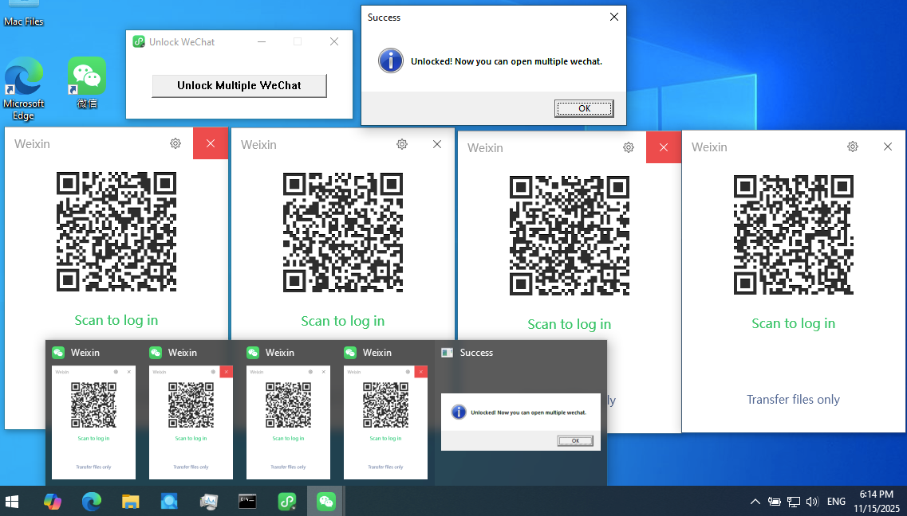
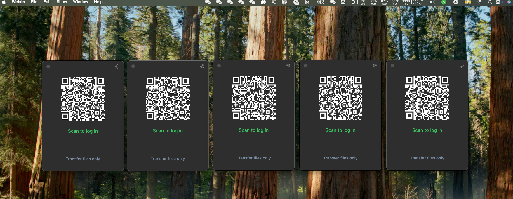

# Unlock WeChat

This tool allows you to run multiple instances of WeChat (Weixin) simultaneously by bypassing its single-instance restriction.

## Features

- Detects running WeChat (Weixin.exe) process
- Injects a DLL to unlock multiple instances
- Simple GUI with one-click unlock
- Checks if already unlocked to avoid unnecessary injection

## Requirements

- Windows operating system
- WeChat installed and running
- Administrator privileges (recommended for injection)

## Building

### Using Visual Studio

Run the PowerShell script:
```powershell
.\build_vs.ps1
```

### Using MinGW

Run the PowerShell script:
```powershell
.\build_mingw.ps1
```

### Using Batch File

Run the batch file:
```batch
build.bat
```

## Usage

1. Start WeChat normally
2. Run `UnlockWeChat.exe`
3. Click the "Unlock Multiple WeChat" button
4. If successful, you can now open additional WeChat instances

## Screenshot






## How it works

The application detects the WeChat process and injects `openmulti.dll` into it. This DLL modifies the mutex check that WeChat uses to enforce single-instance behavior, allowing multiple instances to run.

## Files

- `src/main.c` - Main GUI application
- `openmulti.c` - DLL that unlocks multiple instances
- Build scripts for different compilers

## Disclaimer

Use this tool at your own risk. Modifying running processes may violate terms of service or be considered unauthorized access.

## License

This project is provided as-is without warranty.
